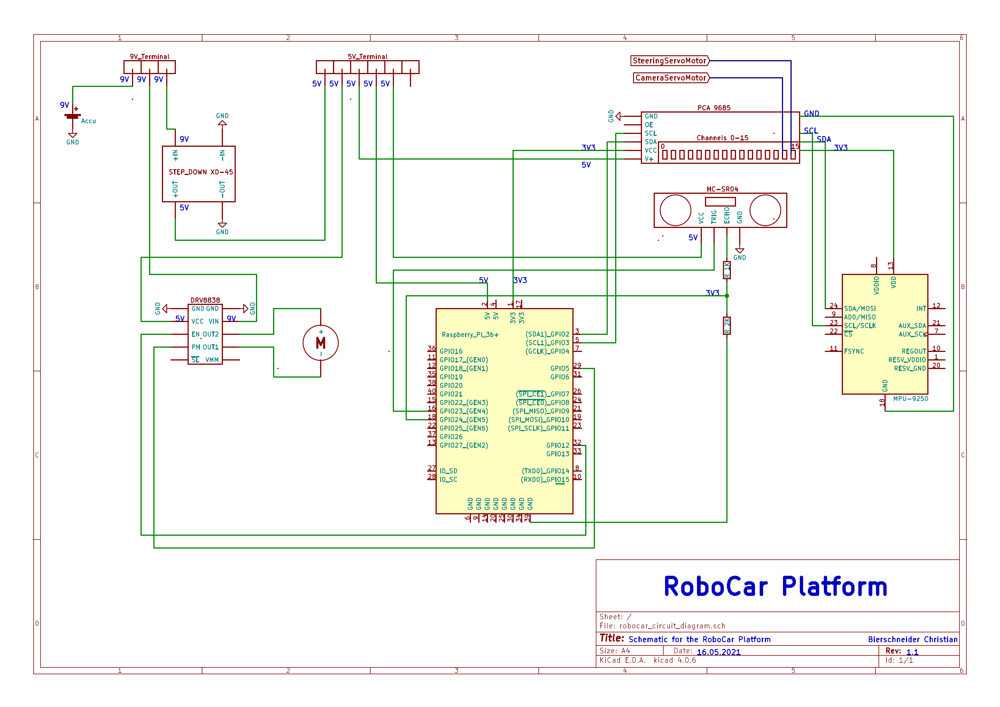

## Schematic for the RoboCar Platform

## GPIO (BCM) / Bus Mapping

**Gearmotor**  
GPIO 12: PWM Pin  
GPIO 5: Direction Pin

**HC-SR04**  
GPIO 23: Trigger Pin 
GPIO 24: Echo Pin 

**MPU9250**  
I2C Bus address: 0x68

**SteeringServoMotor**  
I2C Bus address: 0x40

**CameraServoMotor**  
I2C Bus address: 0x70

